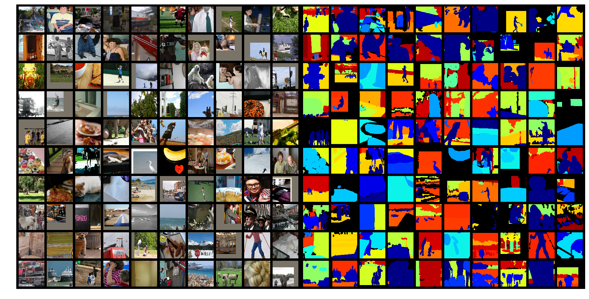

# DeepLab with PyTorch

This is an unofficial implementation to train **DeepLab v2** (ResNet-101) on **COCO-Stuff** dataset.
DeepLab v2 is one of the CNN architectures for semantic image segmentation.
COCO-Stuff is a semantic segmentation dataset, which includes 164k images annotated with 171 thing/stuff classes (+ unlabeled).
In this repository, the model can be trained both on [COCO-Stuff 164k](https://github.com/nightrome/cocostuff) and the outdated [COCO-Stuff 10k](https://github.com/nightrome/cocostuff10k), without building the official DeepLab v2 with Caffe.
Trained models are provided [here](#performance).
ResNet-based DeepLab v3/v3+ are also included, but they are not tested.

## Setup

### Requirements

* python 2.7/3.6
* pytorch
  * [pytorch](https://pytorch.org/) >= 0.4.1
  * [torchvision](https://pytorch.org/)
  * [torchnet](https://github.com/pytorch/tnt)
* [pydensecrf](https://github.com/lucasb-eyer/pydensecrf)
* [tensorflow](https://www.tensorflow.org/install/) (tensorboard)
* [tensorboardX](https://github.com/lanpa/tensorboard-pytorch) >= 1.0
* opencv >= 3.0.0
* tqdm
* click
* addict
* h5py
* scipy
* matplotlib
* yaml

For anaconda users:

```sh
conda env create --file config/conda_env.yaml
conda activate deeplab-pytorch
conda install pytorch -c pytorch  # depends on your environment
```

### Datasets

COCO-Stuff 164k is the latest version and recommended.

<details>
<summary><strong>COCO-Stuff 164k</strong> (click to show the structure)</summary>
<pre>
├── images
│   ├── train2017
│   │   ├── 000000000009.jpg
│   │   └── ...
│   └── val2017
│       ├── 000000000139.jpg
│       └── ...
└── annotations
    ├── train2017
    │   ├── 000000000009.png
    │   └── ...
    └── val2017
        ├── 000000000139.png
        └── ...
</pre>
</details>
<br>

1. Run the script below to download the dataset (20GB+).

```sh
./scripts/setup_cocostuff164k.sh <PATH TO DOWNLOAD>
```

2. Set the path to the dataset in ```config/cocostuff164k.yaml```.

```yaml
DATASET: cocostuff164k
ROOT: # <- Write here
...
```

<details>
<summary><strong>COCO-Stuff 10k</strong> (click to show the structure)</summary>
<pre>
├── images
│   ├── COCO_train2014_000000000077.jpg
│   └── ...
├── annotations
│   ├── COCO_train2014_000000000077.mat
│   └── ...
└── imageLists
    ├── all.txt
    ├── test.txt
    └── train.txt
</pre>
</details>
<br>

1. Run the script below to download the dataset (2GB).

```sh
./scripts/setup_cocostuff10k.sh <PATH TO DOWNLOAD>
```

2. Set the path to the dataset in ```config/cocostuff10k.yaml```.

```yaml
DATASET: cocostuff10k
ROOT: # <- Write here
...
```

### Initial parameters

1. Run the script below to download caffemodel pre-trained on MSCOCO (1GB+).

```sh
./scripts/setup_caffemodels.sh
```

2. Convert the caffemodel to pytorch compatible. No need to build the official DeepLab!

```sh
# This generates deeplabv2_resnet101_COCO_init.pth
python convert.py --dataset coco_init
```
You can also convert an included ```train2_iter_20000.caffemodel``` for PASCAL VOC 2012 dataset. See [here](config/README.md#voc12yaml).

## Training

Training, evaluation, and some demos are all through the [```.yaml``` configuration files](config/README.md).

```sh
# Training
python train.py --config config/cocostuff164k.yaml
```

```sh
# Monitoring
tensorboard --logdir runs
```

Default settings:

- All the GPUs visible to the process are used. Please specify the scope with ```CUDA_VISIBLE_DEVICES=```.
- Stochastic gradient descent (SGD) is used with momentum of 0.9 and initial learning rate of 2.5e-4. Polynomial learning rate decay is employed; the learning rate is multiplied by ```(1-iter/max_iter)**power``` at every 10 iterations.
- Weights are updated 20k iterations for COCO-Stuff 10k and 100k iterations for COCO-Stuff 164k, with a mini-batch of 10. The batch is not processed at once due to high occupancy of video memories, instead, gradients of small batches are aggregated, and weight updating is performed at the end (```batch_size * iter_size = 10```).
- Input images are initially warped to 513x513, randomly re-scaled by factors ranging from 0.5 to 1.5, zero-padded if needed, and randomly cropped to 321x321 so that the input size is fixed during training (see the example below).
- The label indices range from 0 to 181 and the model outputs a 182-dim categorical distribution, but only [171 classes](https://github.com/nightrome/cocostuff/blob/master/labels.md) are supervised with COCO-Stuff.
- Loss is defined as a sum of responses from multi-scale inputs (1x, 0.75x, 0.5x) and element-wise max across the scales. The "unlabeled" class (index -1) is ignored in the loss computation.
- Moving average loss (```average_loss``` in Caffe) can be monitored in TensorBoard.
- GPU memory usage is approx. 11.2 GB with the default setting (tested on the single Titan X). You can reduce it with a small ```batch_size```.

Processed image vs. label examples:



To preserve aspect ratio in the image preprocessing, please modify ```.yaml```:

```yaml
BATCH_SIZE:
    TEST: 1
WARP_IMAGE: False
```

## Evaluation

```sh
python eval.py --config config/cocostuff164k.yaml \
               --model-path checkpoint_final.pth
```

You can run CRF post-processing with a option ```--crf```. See ```--help``` for more details.

## Performance

Results with the provided validation set.

**COCO-Stuff 164k:** after 100k iterations with a mini-batch of 10 ([trained model](https://drive.google.com/file/d/1-rJsLGDXy0nlScos-QLcsQLuEepy5ukv/view?usp=sharing))

||CRF?|Pixel Accuracy|Mean Accuracy|Mean IoU|Frequency Weighted IoU|
|:-:|:-:|:-:|:-:|:-:|:-:|
|DeepLab v2|No|65.6%|49.8%|37.7%|50.1%|
|DeepLab v2|Yes|66.8%|50.3%|38.7%|51.2%|

**COCO-Stuff 10k:** after 20k iterations with a mini-batch of 10 ([trained model](https://drive.google.com/file/d/1epxFDE3O_0LXVpxpde5En1hdMeV9s3e5/view?usp=sharing))

||CRF?|Pixel Accuracy|Mean Accuracy|Mean IoU|Frequency Weighted IoU|
|:-:|:-:|:-:|:-:|:-:|:-:|
|DeepLab v2<br>([**official**](https://github.com/nightrome/cocostuff10k))|No|65.1%|45.5%|34.4%|50.4%|
|DeepLab v2|No|64.8%|45.1%|33.8%|50.1%|
|DeepLab v2|Yes|66.3%|45.8%|34.9%|51.6%|

## Demo

### From an image

```bash
python demo.py --config config/cocostuff164k.yaml \
               --model-path <PATH TO MODEL> \
               --image-path <PATH TO IMAGE>
```

### From a web camera

```bash
python livedemo.py --config config/cocostuff164k.yaml \
                   --model-path <PATH TO MODEL> \
                   --camera-id <CAMERA ID>
```

## References

* [DeepLab: Semantic Image Segmentation with Deep Convolutional Nets, Atrous Convolution, and Fully Connected CRFs](https://arxiv.org/abs/1606.00915)<br>
L. C. Chen, G. Papandreou, I. Kokkinos et al.,<br>
In arXiv, 2016.

* [COCO-Stuff: Thing and Stuff Classes in Context](https://arxiv.org/abs/1612.03716)<br>
H. Caesar, J. Uijlings, V. Ferrari,<br>
In CVPR, 2018.