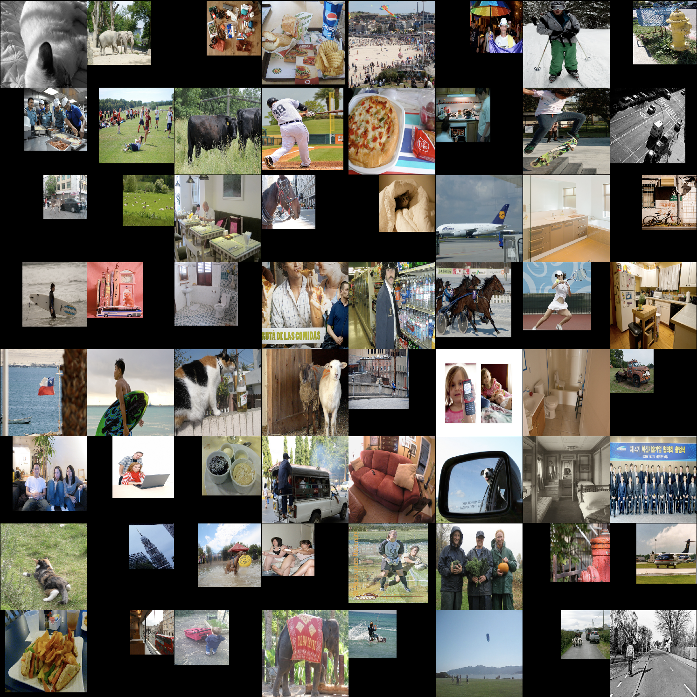
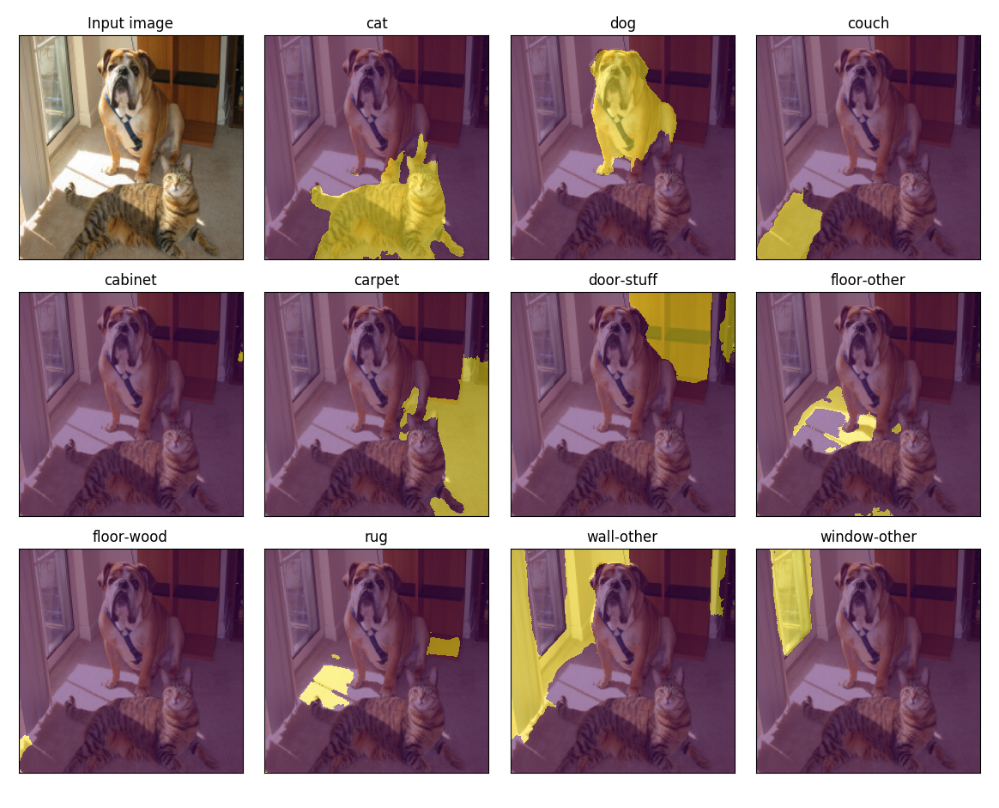

# DeepLab with PyTorch

PyTorch implementation to train **DeepLab v2** on **COCO Stuff 10k** dataset. DeepLab is one of the CNN architectures for semantic image segmentation. COCO Stuff 10k is a semantic segmentation dataset, which includes 10,000 images from 183 thing/stuff classes.

## Prerequisite

* pytorch
  * pytorch 0.3.0
  * torchvision
  * tnt
* cv2
* tensorboardX
* tqdm
* click

## Usage

### Dataset

1. Download [COCO Stuff 10k]() dataset and unzip it.
1. Set the path to the dataset in ```config/default.yaml```.

```
cocostuff-10k-v1.1
├── images
│   ├── COCO_train2014_000000000077.jpg
│   └── ...
├── annotations
│   ├── COCO_train2014_000000000077.mat
│   └── ...
├── imageLists
│   ├── all.txt
│   ├── test.txt
│   └── train.txt
├── cocostuff-labels.txt
└── cocostuff-10k-v1.1.json
```

### Models

1. Download [init.caffemodel]() pre-trained on MS COCO under the directory ```data/models/deeplab_resnet101/coco_init/```.
1. Convert the caffemodel to PyTorch compatible. No need to build the official implementation.

```sh
# This generates deeplabv2_resnet101_COCO_init.pth
python convert.py --dataset coco_init
```

### Training

```sh
python train.py [--help]
```
Default settings:
* Stochastic gradient descent (SGD) is used with momentum of 0.9 and initial learning rate of 2.5e-4. Polynomial learning rate decay is employed; the learning rate is multiplied by ```(1-iter/max_iter)**power``` at every 10 iterations.
* Weights are updated 20,000 iterations with mini-batch of 10. The batch is not processed at once due to high occupancy of video memories, instead, gradients of small batches are aggregated, and weight updating is performed at the end (```batch_size * iter_size = 10```).
* Input images are randomly scaled by factors ranging from 0.5 to 1.5, and are randomly cropped or zero-padded so that the input size is fixed during training.
* Loss is defined as a sum of responses from multi-scale inputs (1x, 0.75x, 0.5x) and element-wise max across the scales. The "unlabeled" class (index 0) is ignored in the loss computation.
* Fully-connected CRF is used as a postprocessing for outputted probability maps. Grid search is not implemented in this repository.
* Moving average loss (```average_loss``` in Caffe) can be monitored in TensorBoard (please specify a log directory, e.g., ```runs```).
* GPU memory usage is approx. 5.8 GB with the default setting (tested on Tesla K80)



### Evaluation

```
python eval.py [--help]
```

### Demo

#### COCO-Stuff
WIP

#### PASCAL VOC2012

You can also convert *train2_iter_20000.caffemodel* which has fine-tuned on VOC2012 with an option ```--dataset voc12```.

```sh
# This generates deeplabv2_resnet101_VOC2012.pth
python convert.py --dataset voc12
```

```sh
# This opens an another window like the following
python demo.py --dataset voc12 --image_path <path to an image>
```


## References
* DeepLab v2: https://arxiv.org/abs/1606.00915
* COCO-Stuff: https://arxiv.org/abs/1612.03716