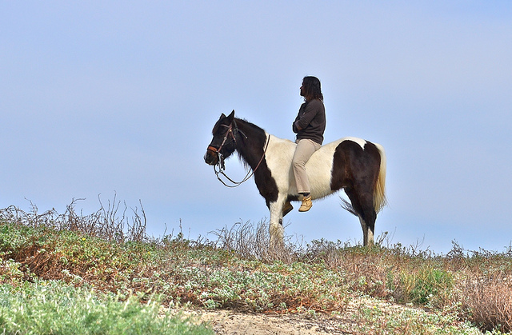

# DeepLab v2 with PyTorch

PyTorch implementation to train **DeepLab v2** model on **COCO Stuff 10k** dataset. DeepLab is one of the CNN architectures for semantic image segmentation. COCO Stuff 10k is a semantic segmentation dataset, which includes 10,000 images from 183 thing/stuff classes.
|Input image|Result|
|:-:|:-:|
|||
|||
|||
## Prerequisite

* pytorch
  * pytorch 0.2.0
  * torchvision
  * tnt
* tensorboardX
* tqdm
* cv2

## Usage

### Dataset

Download the followings and set the paths to ```config/default.yaml```.

* Init parameters from MS COCO.
* COCO Stuff 10k

### Training

```sh
python train.py [-h]
```

* Stochastic gradient descent (SGD) is used with momentum of 0.9 and initial learning rate of 2.5e-4. Polynomial learning rate decay is employed; the learning rate is multiplied by ```(1-iter/max_iter)**power``` at every 10 iterations.
* Weights are updated 20,000 iterations with mini-batch of 10. The batch is not processed at once due to high occupancy of video memories, instead, gradients from semi-batch loss are aggregated and finally the SGD is performed (```batch_size * iter_size = 10```).
* Input images are randomly scaled by factors ranging from 0.5 to 1.5, and are randomly cropped or zero-padded so that the input size is fixed during training.
* Loss is defined as a sum of responses from multi-scale inputs (1x, 0.75x, 0.5x) and element-wise max across the scales. The "unlabeled" class (index 0) is ignored in the loss computation.
* Fully-connected CRF is used as a postprocessing for outputted probability maps. Grid search is not implemented in this repository.
* Moving average loss (```average_loss``` in Caffe) can be monitored in TensorBoard (please specify a log directory, e.g., ```runs```).
* GPU memory usage is approx. 5.8 GB with the default setting (tested on Tesla K80)

### Evaluation

```
python eval.py [-h]
```

### Demo

```
python demo.py --image <path to an image>
```


