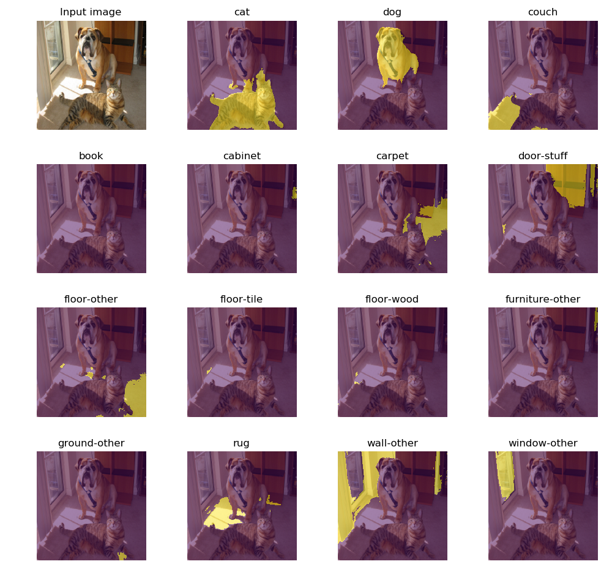
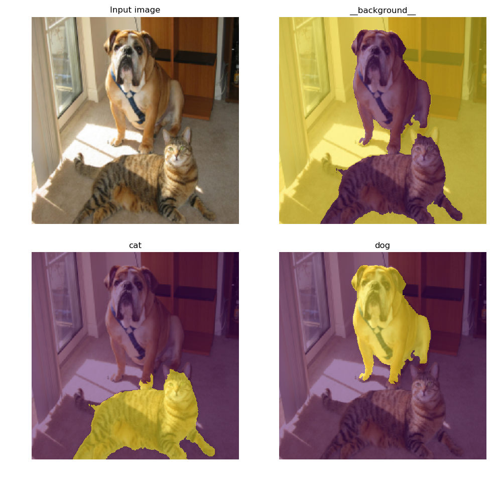
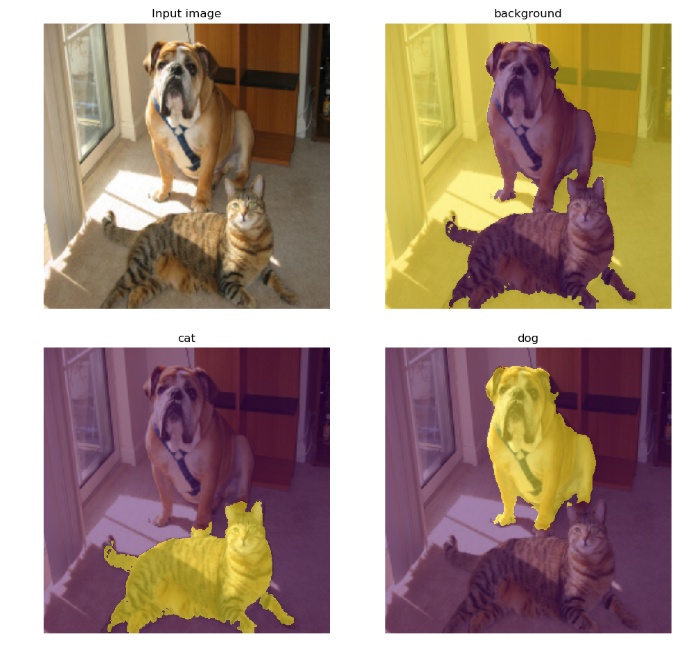

# DeepLab with PyTorch <!-- omit in toc --> 

This is an unofficial **PyTorch** implementation to train **DeepLab v2** [[1](##references)] on **COCO-Stuff** dataset [[2](##references)] and **PASCAL VOC** dataset [[3]()]. The model can be trained without building the official implementation in Caffe. [Pre-trained models are provided](#pre-train-models). ResNet-based DeepLab v3/v3+ models are also included, although they are not tested. [```torch.hub``` is supported](#torchhub).

- [Setup](#setup)
  - [Requirements](#requirements)
  - [Datasets](#datasets)
  - [Initial weights](#initial-weights)
- [Training](#training)
- [Evaluation](#evaluation)
- [Performance](#performance)
  - [COCO-Stuff](#coco-stuff)
  - [PASCAL VOC 2012](#pascal-voc-2012)
  - [Pretrained models](#pretrained-models)
- [Demo](#demo)
  - [Single image](#single-image)
  - [Webcam](#webcam)
  - [torch.hub](#torchhub)
- [Misc](#misc)
  - [Difference with Caffe version](#difference-with-caffe-version)
  - [Training batch normalization](#training-batch-normalization)
- [References](#references)

## Setup

### Requirements

For Anaconda users:

```sh
# Please modify CUDA option (default: 10.0)
conda env create --file config/conda_env.yaml
```

* Python 2.7+/3.6+
* [pytorch](https://pytorch.org/) 0.4.1+
* [torchvision](https://pytorch.org/)
* [torchnet](https://github.com/pytorch/tnt)
* [pydensecrf](https://github.com/lucasb-eyer/pydensecrf)
* [tensorflow](https://www.tensorflow.org/install/) (for tensorboard)
* [tensorboardX](https://github.com/lanpa/tensorboard-pytorch) 1.0+
* opencv 3.0.0+
* tqdm
* click
* addict
* scipy
* matplotlib
* yaml
* joblib

### Datasets

Setup instruction is provided in each link.

* [COCO-Stuff 10k/164k](data/datasets/cocostuff/README.md)
* [PASCAL VOC 2012](data/datasets/voc12/README.md)

### Initial weights

1. Run the script below to download caffemodel pre-trained on ImageNet and 91-class COCO (1GB+).

```sh
./scripts/setup_caffemodels.sh
```

2. Convert the caffemodel to pytorch compatible. No need to build the official DeepLab in Caffe!

```sh
# This generates "deeplabv2_resnet101_COCO_init.pth" from "init.caffemodel"
python convert.py --dataset init
```

## Training

Training, evaluation, and some demos are all through the [YAML configuration files](configs).

```sh
python main.py train --config-path configs/cocostuff164k.yaml
```

* ```-c```, ```--config-path```: YAML file for dataset configuration (required)
* ```--cuda/--cpu```: Switch GPU/CPU (default: GPU)

```sh
# Monitor a cross-entropy loss
tensorboard --logdir runs
```

Common settings:

- **Model**: DeepLab v2 with ResNet-101 backbone. Dilated rates of ASPP are (6, 12, 18, 24). Output stride is 8.
- **Multi-GPU**: All the GPUs visible to the process are used. Please specify the scope with
```CUDA_VISIBLE_DEVICES=```.
- **Multi-scale loss**: Loss is defined as a sum of responses from multi-scale inputs (1x, 0.75x, 0.5x) and
element-wise max across the scales. The *unlabeled* class is ignored in the loss computation.
- **Gradient accumulation**: The mini-batch of 10 samples is not processed at once due to the high occupancy of GPU
memories. Instead, gradients of small batches of 5 samples are accumulated for 2 iterations, and weight updating is
performed at the end (```batch_size * iter_size = 10```). GPU memory usage is approx. 11.2 GB with the default setting
(tested on the single Titan X). You can reduce it with a small ```batch_size```.
- **Learning rate**: Stochastic gradient descent (SGD) is used with momentum of 0.9 and initial learning rate of
2.5e-4. Polynomial learning rate decay is employed; the learning rate is multiplied by ```(1-iter/iter_max)**power```
at every 10 iterations.
- **Monitoring**: Moving average loss (```average_loss``` in Caffe) can be monitored in TensorBoard.

[COCO-Stuff 164k](config/cocostuff164k.yaml):
- **#Iterations**: Updated 100k iterations.
- **#Classes**: The label indices range from 0 to 181 and the model outputs a 182-dim categorical distribution, but
only [171 classes](https://github.com/nightrome/cocostuff/blob/master/labels.md) are supervised with COCO-Stuff. Index 255 is an unlabeled class to be ignored.
- **Preprocessing**: (1) Input images are randomly re-scaled by factors ranging
from 0.5 to 1.5, (2) padded if needed, and (3) randomly cropped to 321x321.

[COCO-Stuff 10k](config/cocostuff10k.yaml):
- **#Iterations**: Updated 20k iterations.
- **#Classes**: Same as the 10k version above.
- **Preprocessing**: (1) Input images are initially warped to 513x513 squares, (2) randomly re-scaled by factors ranging from
0.5 to 1.5, (3) padded if needed, and (4) randomly cropped to 321x321 so that the input size is fixed during training.

[PASCAL VOC 2012](config/voc12.yaml):
- **#Iterations**: Updated 20k iterations.
- **#Classes**: 20 foreground objects + background. Index 255 is an unlabeled class to be ignored.
- **Preprocessing**: (1) Input images are randomly re-scaled by factors ranging from 0.5 to 1.5, (2) padded if needed, and (3) randomly cropped
to 321x321.

Processed image vs. label examples in COCO-Stuff:


## Evaluation

This produces scores (.json) and logits (.npy)

```bash
python main.py test \
    --config-path configs/cocostuff164k.yaml \
    --model-path data/models/deeplab_resnet101/cocostuff164k/checkpoint_final.pth
```

* ```-c```, ```--config-path```: YAML file for dataset configuration (required)
* ```-m```, ```--model-path```: PyTorch model file (required)
* ```--cuda/--cpu```: Switch GPU/CPU (default: GPU)

To perform CRF post-processing:

```bash
python main.py crf \
    --config-path configs/cocostuff164k.yaml \
    --model-path data/models/deeplab_resnet101/cocostuff164k/checkpoint_final.pth
```

* ```-c```, ```--config-path```: YAML file for dataset configuration (required)
* ```-m```, ```--model-path```: PyTorch model file (required)
* ```--cuda/--cpu```: Switch GPU/CPU (default: GPU)

## Performance

***TODO: Add COCO-Stuff 164k results and pretrained models***

### COCO-Stuff

<table>
    <tr>
        <th>Train set</th>
        <th>Eval set</th>
        <th>CRF?</th>
        <th>Code</th>
        <th>Pixel<br>Accuracy</th>
        <th>Mean<br>Accuracy</th>
        <th>Mean IoU</th>
        <th>FreqW IoU</th>
    </tr>
    <tr>
        <td rowspan="3">10k <i>train</i> &dagger;</td>
        <td rowspan="3">10k <i>val</i> &dagger;</td>
        <td rowspan="2">No</td>
        <td>Original [<a href="#references">2</a>]</td>
        <td><strong>65.1</strong></td>
        <td><strong>45.5</strong></td>
        <td><strong>34.4</strong></td>
        <td><strong>50.4</strong></td>
    </tr>
    <tr>
        <td>Ours</td>
        <td><strong>65.8</td>
        <td><strong>45.7</strong></td>
        <td><strong>34.8</strong></td>
        <td><strong>51.2</strong></td>
    </tr>
    <tr>
        <td>Yes</td>
        <td>Ours</td>
        <td>67.1</td>
        <td>46.4</td>
        <td>35.6</td>
        <td>52.5</td>
    </tr>
    <tr>
        <td rowspan="4">164k <i>train</i></td>
        <td rowspan="2">10k <i>val</i></td>
        <td>No</td>
        <td>Ours</td>
        <td></td>
        <td></td>
        <td></td>
        <td></td>
    </tr>
    <tr>
        <td>Yes</td>
        <td>Ours</td>
        <td></td>
        <td></td>
        <td></td>
        <td></td>
    </tr>
    <tr>
        <td rowspan="2">164k <i>val</i></td>
        <td>No</td>
        <td>Ours</td>
        <td></td>
        <td></td>
        <td></td>
        <td></td>
    </tr>
    <tr>
        <td>Yes</td>
        <td>Ours</td>
        <td></td>
        <td></td>
        <td></td>
        <td></td>
    </tr>
</table>

&dagger; Images and labels are pre-warped to square-shape 513x513

### PASCAL VOC 2012

<table>
    <tr>
        <th>Train set</th>
        <th>Eval set</th>
        <th>CRF?</th>
        <th>Code</th>
        <th>Pixel<br>Accuracy</th>
        <th>Mean<br>Accuracy</th>
        <th>Mean IoU</th>
        <th>FreqW IoU</th>
    </tr>
    <tr>
        <td rowspan="4"><i>trainaug</i></td>
        <td rowspan="4"><i>val</i></td>
        <td rowspan="2">No</td>
        <td>Original [<a href="#references">3</a>]</td>
        <td>-</td>
        <td>-</td>
        <td><strong>76.35</strong></td>
        <td>-</td>
    </tr>
    <tr>
        <td>Ours</td>
        <td>94.64</td>
        <td>86.50</td>
        <td><strong>76.65</td>
        <td>90.41</td>
    </tr>
    <tr>
        <td rowspan="2">Yes</td>
        <td>Original [<a href="#references">3</a>]</td>
        <td>-</td>
        <td>-</td>
        <td><strong>77.69</strong></td>
        <td>-</td>
    </tr>
    <tr>
        <td>Ours</td>
        <td>95.04</td>
        <td>86.64</td>
        <td><strong>77.93</strong></td>
        <td>91.06</td>
    </tr>
</table>

### Pretrained models

* ~~Pretrained models (*.pth)~~
* ~~Scores (*.json)~~

## Demo

|           COCO-Stuff 164k           |           COCO-Stuff 10k            |          PASCAL VOC          |         Pretrained COCO          |
| :---------------------------------: | :---------------------------------: | :--------------------------: | :------------------------------: |
|  |  |  |  |


### Single image

```bash
python demo.py single \
    --config-path configs/cocostuff164k.yaml \
    --model-path data/models/deeplab_resnet101/cocostuff164k/checkpoint_final.pth \
    --image-path docs/cat_dog.png \
```

* ```-c```, ```--config-path```: YAML file for dataset configuration (required)
* ```-m```, ```--model-path```: PyTorch model file (required)
* ```-i```, ```--image-path```: Image to be processed (required)
* ```--crf```: CRF post-processing (default: False)
* ```--cuda/--cpu```: Switch GPU/CPU (default: GPU)

### Webcam

A class of mouseovered pixel is shown in terminal.

```bash
python demo.py live \
    --config-path configs/cocostuff164k.yaml \
    --model-path data/models/deeplab_resnet101/cocostuff164k/checkpoint_final.pth \
```

* ```-c```, ```--config-path```: YAML file for dataset configuration (required)
* ```-m```, ```--model-path```: PyTorch model file (required)
* ```-i```, ```--image-path```: Image to be processed (required)
* ```--crf```: CRF post-processing (default: False)
* ```--camera-id```: Camera ID (default: 0)
* ```--cuda/--cpu```: Switch GPU/CPU (default: GPU)

### torch.hub


Model setup with 3 lines.

```python
import torch.hub
model = torch.hub.load("kazuto1011/deeplab-pytorch", "deeplabv2_resnet101", n_classes=182)
model.load_state_dict(torch.load("cocostuff164k_iter100k.pth"))
```

## Misc

### Difference with Caffe version

* While the official code employs 1/16 bilinear interpolation (```Interp``` layer) for downsampling a label for only 0.5x input, this codebase does for both 0.5x and 0.75x inputs with nearest interpolation (```PIL.Image.resize```).
* Bilinear interpolation on images and logits is performed with the ```align_corners=False```.

### Training batch normalization


This codebase only supports DeepLab v2 training which freezes batch normalization layers, although
v3/v3+ protocols require training them. If training their parameters on multiple GPUs as well in your projects, please
install [the extra library](https://hangzhang.org/PyTorch-Encoding/) below.

```bash
pip install torch-encoding
```

Batch normalization layers in a model are automatically switched in ```libs/models/resnet.py```.

```python
try:
    from encoding.nn import SyncBatchNorm
    _BATCH_NORM = SyncBatchNorm
except:
    _BATCH_NORM = nn.BatchNorm2d
```

## References

1. L.-C. Chen, G. Papandreou, I. Kokkinos, K. Murphy, A. L. Yuille. DeepLab: Semantic Image
Segmentation with Deep Convolutional Nets, Atrous Convolution, and Fully Connected CRFs. *IEEE TPAMI*,
2018.<br>
[Project](http://liangchiehchen.com/projects/DeepLab.html) /
[Code](https://bitbucket.org/aquariusjay/deeplab-public-ver2) / [arXiv
paper](https://arxiv.org/abs/1606.00915)

2. H. Caesar, J. Uijlings, V. Ferrari. COCO-Stuff: Thing and Stuff Classes in Context. In *CVPR*, 2018.<br>
[Project](https://github.com/nightrome/cocostuff) / [arXiv paper](https://arxiv.org/abs/1612.03716)

1. M. Everingham, L. Van Gool, C. K. I. Williams, J. Winn, A. Zisserman. The PASCAL Visual Object
Classes (VOC) Challenge. *IJCV*, 2010.<br>
[Project](http://host.robots.ox.ac.uk/pascal/VOC) /
[Paper](http://host.robots.ox.ac.uk/pascal/VOC/pubs/everingham10.pdf)